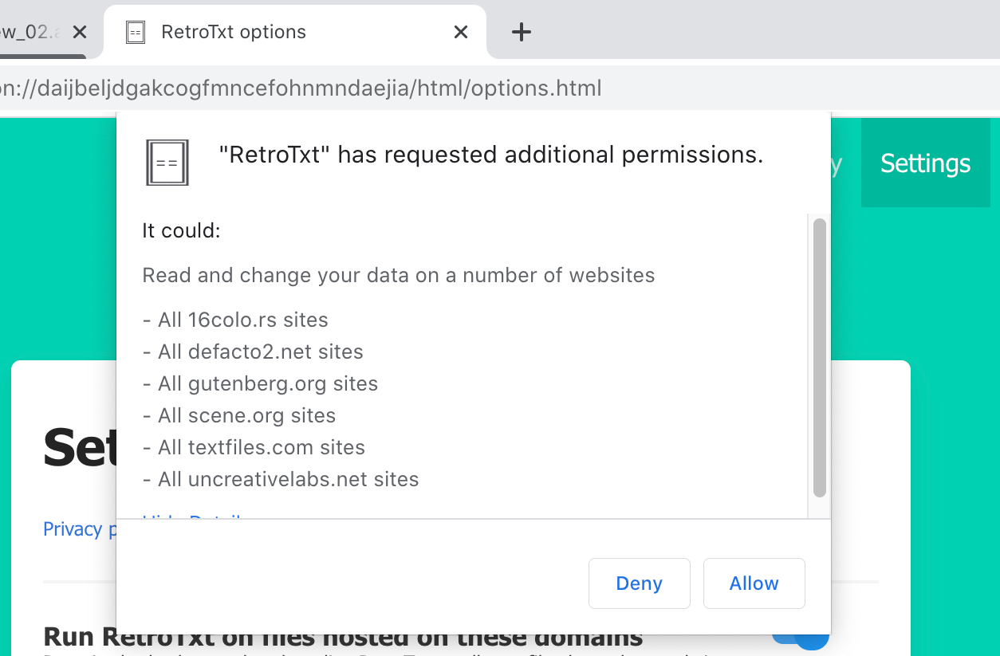
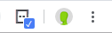

# RetroTxt

### Version 5.0

#### [Manifest V3 project progress](https://github.com/bengarrett/RetroTxt/projects/2)

**About:** By the end of 2022, Google is forcibly ending Chrome compatibility with all Manifest V2 web extensions. This means RetroTxt v4 will stop working but the replacement MV3 API is not backward compatible, nor feature complete.

This branch intends to have ready a Manifest V3 compatible edition of RetroTxt available by the deadline. It will be released as RetroTxt version 5.0 even though there will be very few new features. The `minimum_chrome_version` value of the manifest.json will be set to the first release of Chrome (V109?) that does not support Manifest V2. Thus allowing the use of RetroTxt v4.x as long as possible for those who want it.

**Major issues:**

RetroTxt v5 will not work in Firefox for the moment. <small>[There is planned partial MV3 support for the end of 2022](https://blog.mozilla.org/addons/2022/05/18/manifest-v3-in-firefox-recap-next-steps/)</small>.

*Use RetroTxt as a local text file viewer* does not work.

The omnibox input doesn't work but should be fixed in Chrome v101-102?

#### To use and test:

```bash
git clone git@github.com:bengarrett/RetroTxt.git

git checkout MV3
```

- Open your browser.
- In the settings and more menu, select _Extensions_, manage _Extensions_.
- Confirm the _Developer mode_ is toggled.
- Click the _Load Unpacked_ button.
- Browse to and select `ext/` in the git cloned `RetroTxt/` directory.


**Note:** The readme below is for RetroTxt v4.

---


Turn pieces of ANSI text art and ASCII, NFO documents into HTML using RetroTxt. RetroTxt is the Extension that takes legacy and plain text files and stylizes them into a more acceptable, useful format to view or copy from a web browser tab.

## Install from the [Chrome Store](https://chrome.google.com/webstore/detail/retrotxt/gkjkgilckngllkopkogcaiojfajanahn), [Microsoft Addons](https://microsoftedge.microsoft.com/addons/detail/hmgfnpgcofcpkgkadekmjdicaaeopkog), or [Firefox Addons](https://addons.mozilla.org/en-US/firefox/addon/retrotxt)

#### View ANSI, ASCII, NFO, Shift JIS text art as HTML

#### View server and dev-op logs styled with colored text

#### 16.7 million, 256 and standard 16 color support

#### View BBS colored text files for Celerity, PC Board, Renegade, Telegard, Wildcat!, WVIV systems

- [x] Swappable palettes; VGA, CGA, xterm, monochrome, Apple IIgs, Commodore 64 and switchable iCE Colors
- [x] Customizable font and background colors
- [x] SAUCE metadata parsing
- [x] Multiple text encodings support including CP-437, ISO-8959-1, Windows-1252, Shift JIS
- [x] Automatic block character, line artifact fixes
- [x] Hundreds of IBM PC font choices such as VGA, PS/2, EGA, CGA, MDA plus variants, and more
- [x] Various Amiga and home computer system fonts; Commodore, Atari, Apple, and more

#### [Check out the documentation](https://docs.retrotxt.com)


#### ☕ [Support RetroTxt, why not buy me a coffee?](https://www.buymeacoffee.com/4rtEGvUIY)

## Install

### [Chrome](https://chrome.google.com/webstore/detail/retrotxt/gkjkgilckngllkopkogcaiojfajanahn) · [Firefox](https://addons.mozilla.org/en-US/firefox/addon/retrotxt) · [Edge](https://microsoftedge.microsoft.com/addons/detail/hmgfnpgcofcpkgkadekmjdicaaeopkog) · [Brave](https://chrome.google.com/webstore/detail/retrotxt/gkjkgilckngllkopkogcaiojfajanahn)

### [Or use the source code](https://docs.retrotxt.com/source_code).

### Requirements

**Chrome, Chromium 72**, or **Firefox 69** or newer browsers.

## Post-installation

You can test the RetroTxt install by clicking on one of the many sample artworks found in the <em>Samples</em> tab from RetroTxt options or typing `rt samples` in the browser address bar.

## Configuration

Out of the box, some useful features of RetroTxt are off as most browsers require you to grant permission before RetroTxt can [access the specific browser data](https://docs.retrotxt.com/privacy) it needs. These are in the <em>Settings</em> tab from RetroTxt options or typing `rt settings` in the browser address bar.



## Run RetroTxt

Once configured, RetroTxt will run on any text or ANSI art file observed in a permitted browser tab and mark the toolbar icon with a check.



Elsewhere there are thousands of text files hosted at [textfiles.com](http://textfiles.com/directory.html) or the [Project Gutenberg](https://www.gutenberg.org/catalog) plain-text books.
Turn on the <em>Use RetroTxt as a local text file viewer</em> setting.
Then download one of the fantastic text art packs found at [16 colors](https://16colo.rs) and use the `file:///` protocol to browse and view the text art files saved to your computer.

### Permissions

Chrome, Brave, and Edge require the **Allow access to file URLs** Extension setting enabled if you wish to use RetroTxt with text files stored on your computer.

## Privacy

RetroTxt does not collect or transmit any data created by your web browser.

All data generated by the Extension is only ever stored locally on your computer by using the browser local or session storage APIs.

[RetroTxt Privacy](https://docs.retrotxt.com/privacy)

## License

### GNU LESSER GENERAL PUBLIC LICENSE

#### An important note about the license

While RetroTxt uses a [GNU Lesser General Public License v3.0](https://choosealicense.com/licenses/lgpl-3.0), the included fonts **are not**. You should read each font license in the `fonts/` subdirectory before redistribution, as some of the authors do not permit the sale or modification of their fonts or collections.

## Credits

RetroTxt by [Ben Garrett](https://devtidbits.com/ben-garrett), [mail](mailto:code.by.ben@gmail.com)

RetroTxt ANSI logo Zeus II [Twitter @Zeus_II](https://twitter.com/Zeus_II)

- [_The Ultimate Oldschool PC Font Pack_](https://int10h.org/oldschool-pc-fonts) by Viler
- [_Retro Computer Fonts_](https://www.kreativekorp.com/software/fonts/index.shtml#retro) by Kreative Korp

* [_Atari Classic TrueType Fonts_](http://members.bitstream.net/marksim/atarimac/fonts.html) by Mark L. Simonson
* [_Atari ST 8x16 System_](https://www.dafont.com/atari-st-8x16-system-font.font) by divVerent
* [_C64 TrueType_](https://style64.org/c64-truetype) by Style
* [_IBM 3270_](https://github.com/rbanffy/3270font) by Ricardo Banffy
* [_Mona_](http://monafont.sourceforge.net/index-e.html) public domain
* [_Multi Platform Fonts_](https://github.com/rewtnull/amigafonts) by TrueSchool Ascii
* [_Plex_](https://github.com/IBM/plex) by IBM Corp.
* [_Spleen_](https://github.com/fcambus/spleen) by Frederic Cambus
* [_Unscii_](http://pelulamu.net/unscii) by Viznut

CSS framework by [Bulma](https://bulma.io)

Options icons by [Google Material Design](https://material.io/resources/icons)
