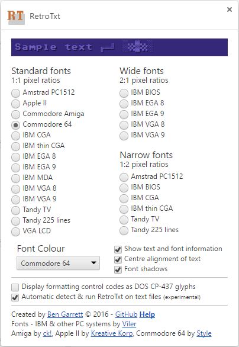
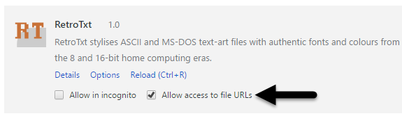
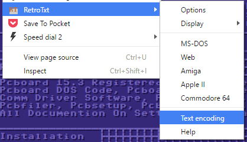

# RetroTxt

RetroTxt is a handy little extension that takes old fashioned text files and stylises them in a more pleasing visual format. Despite the web being built on text, web browsers are often incapable of accurately displaying texts written during the pre and early web eras. This is where RetroTxt comes in! It imports the text into a modern format, injects a font that mimics a chosen retro computer, then applies styling to improve the display and readability. It can also double up as a text viewer for your locally stored, off-line files and even serve as an NFO text viewer.

In developing this extension I had a few goals in mind.

* Make it simple, by focusing on the styling of the text rather than extensive, cryptic character conversion options.
* Make it text, to take advantage of the browser's text parsing and rendering features for resizing, styles, searchability and accessibility.
* Make it semi-automated, so you can configure it once and then forget.
* Make it convenient, by using context menus that contain some of the more useful features and options.
* Make it light, by using the recommended Chrome guidelines to have less impact on your browser resources.

---

[](http://www.youtube.com/watch?v=VR9jpLaVO20)

## Install
Chrome and compatible browsers (Vivaldi, Chromium) can install the extension using the Chrome Store.

[RetroTxt on Chrome store](https://chrome.google.com/webstore/detail/retrotxt/gkjkgilckngllkopkogcaiojfajanahn)

You can test your new RetroTxt install with the thousands of text files hosted at [textfiles.com](http://textfiles.com/directory.html) or with [Project Gutenberg's](http://www.gutenberg.org/catalog/) _plain text_ books.
## Requirements
Chrome __41__, newer or compatible browser.

- Depends on JavaScript [Template literals](https://developer.mozilla.org/en-US/docs/Web/JavaScript/Reference/Template_literals) introduced in Chrome 41.
- Uses the [V2 Options page](https://developer.chrome.com/extensions/optionsV2) introduced in Chrome 40.

Tested on [Chrome](https://www.google.com/intl/en/chrome/browser/desktop/index.html) for Windows, [Chromium](https://www.chromium.org/Home) on Linux, [ChromeOS](https://www.chromium.org/chromium-os), [Vivaldi](https://vivaldi.com/) for Windows and Linux.

## Options Help



######Show text and font information

Reveals a small text header detailing the document size and font information.


[columns] x [lines] [font] [font width]x[font height]

* _columns_ the number of characters per line.
* _lines_ the number of lines counted in the text.
* _font_ the font family currently in use.
* _font width_ the pixel width of each text character, all fonts are fixed, mono-spaced.
* _font height_ the pixel height of each text character.

######Center alignment of text

Centres the vertical and horizontal positioning of the text.

######Font shadows

Applies a subtle shadow effect to each character and glyph within the text.

######Display formatting control codes as DOS CP-437 glyphs

IBM's and MS-DOS's Code Page 437 has a few glyphs values that are normally reserved for document formatting (control characters). Enabling this will display these glyphs on-screen.
- ◘ _backspace_
- ○ _tab_
- ♪ _carriage return_
- → _EOF_ (end of file)
- ⌂ _delete_

######Automatic detect & run RetroTxt on text files (experimental)

Runs the extension in the background and applies RetroTxt on all text files encountered by Chrome. This offers a better user experience but unfortunately comes with some caveats due to limitations imposed by Chrome.

1. It only works with files hosted on _web_ servers or those stored on your local computer and accessed using the `file:///` scheme. `ftp://` does not work.
2. RetroTxt can access web server meta-data describing the text encoding and general purpose of a file. So it is relatively accurate in discovering text files over the web.
3. `file:///` has no access to any meta-data nor can RetroTxt read the content of the file when it needs to, so instead it relies on a file extension blacklist. This, unfortunately, is less accurate and prone to false-positives.
4. `file:///` also cannot detect a file's character encoding and so RetroTxt may fail to correctly render newer Unicode texts.

If RetroTxt inaccurately converts a text, you can disable RetroTxt character encoding conversion by right-clicking on the page and select __Text encoding__ from the __RetroTxt__ menu. Or you can also click the RetroTxt toolbar button  to switch back to the original text. 

## Context Menu Help

######Display

- __Text and font information__ runs the Option _Show text and font information_
- __Text alignment__ runs the Option _Center alignment of text_
- __Font shadows__ runs the Option _Font shadows_


- __MS-DOS__ 
- __Web__ 
- __Amiga__ 
- __Apple II__
- __Commodore 64__

Are coloured, retro computer font themes that _will overwrite_ your previously chosen selections done in the Options dialogue.

- __Text encoding__

Available only from the page context menu, when you click this item the page will be refreshed. This enables you to disable the character encoding conversion that RetroTxt normally applies to text. This may be useful if RetroTxt mistakenly scrambles a Unicode text file or when you're trying to view text written in a non-English (Latin-1) code page.

## Permissions

RetroTxt requires __Read and change all your data on the websites that you visit__ access so it can apply its styling and rendering to text files hosted online.

It also needs __Allow access to file URLs__ selected if you wish to use RetroTxt with text files stored on your local computer.

When __Automatic detect & run RetroTxt on text files__ is enabled (it is by default). RetroTxt will make background `XMLHttpRequest()` `HEAD` requests to the opened websites you visit so it can fetch their `HTTP HEAD` responses. This meta-data is used to decide if the page is HTML or a text file and which character encoding is in use.

## Q.A.

#### Can I adjust the size of the font?

You can adjust the _zoom_ of the font by using the __Ctrl +__ and __Ctrl -__ keys.

#### Can I view files stored on my computer?

By typing a path into the address bar, Chrome is quite happy to read files and directories stored locally on your computer.

On Windows, for example, pasting `C:\Users\Ben\Downloads\myfile.txt` into Chrome will convert it to into a browser-friendly file URI and view the document in the browser.
```
file:///C:/Users/Ben/Downloads/myfile.txt
```

You can also [browse your Windows drive](file:///C:/) or [your Linux and OSX drives](file:///).

Chrome will need [__Allow access to the file URLs__ permission](chrome://extensions/) enabled if you want the __Automatic detect & run RetroTxt on text files__ feature to work with local files.  If it is selected by default, you should reselect it so the permission is actually applied by Chrome.


To make Chrome your default text file viewer in Windows. Right-click on your desktop and choose __text file__ under __New__. This creates the file `New Text Document.txt`. Right-click on the file, select __Choose another app__ (_Choose default program..._ in Windows 7) under __Open with__ item. Then under __Other options__ scroll down and select Chrome.

#### Is the conversion and styling historically accurate?
Somewhat but it depends. The extension is English-centric, focusing on [CP-437](https://msdn.microsoft.com/en-us/goglobal/cc305156.aspx), [ISO 8850-15](https://msdn.microsoft.com/en-us/goglobal/cc305176) and [Windows 1252](https://msdn.microsoft.com/en-us/goglobal/cc305145) code page support. Text files written in character encodings for other European languages will mostly render but the text may not be accurate. Non-Latin based languages will probably be illegible.

The extension uses TrueType fonts which are affected by the operating system's font smoothing effects; ClearType on Windows, Quartz in OS X and FreeType on Linux. The degree of the font modification depends on the effect applied and the colour combinations in use with the text. Darker backgrounds seem to suffer less than light ones.

A number of fonts were designed for 40 columns (characters per line of text) but the extension doesn't enforce that limitation.

The web browser and the operating system can make modifications the font width, height, and spacing for either accessibility or due to user applied themes.

The Apple II, Commodore Amiga, Commodore 64, VGA LCD fonts were a bit small and have been up-sized by 1.5x. You can return these fonts to their original size by pressing __Ctrl -__ in Chrome and reducing the font size to _67%_.

#### What text encodings are supported?
- UTF-8 Unicode (Windows, OS X, Linux)
- ISO/IEC 8859-15 (Windows, Commodore Amiga*, Linux)
- Windows 1252 (Windows)
- Code page 437 (PC/MS-DOS, NFO and ASCII text art)
- ASCII-1967/US-ASCII (Universal, American English legacy text)


*The Amiga uses 1987 ISO 8859-1 encoding, it's near identical to 1999 ISO 8859-15 except for [8 character differences](https://en.wikipedia.org/wiki/ISO/IEC_8859-15).

###### Platform specific encodings that are not currently supported
- Mac OS Roman (Apple Macintosh)
- ATASCII (8-bit Atari computers) & Atari ST character set
- PETSCII (Commodore 8-bit computers)


#### Text is garbled
There could be a number of causes of this but generally it is related to the web server or browser choosing the incorrect character encoding for the file. You can manually switch this in Chrome. Click the Chrome menu icon  and select __Encoding__ from the __More tools__ menu. Choose a more suitable character encoding, but if you are not quite sure which one to use and you know the document is in English. First, try the __Unicode (UTF-8)__ then each of the other __Western__ options.

You could also disable RetroTxt character encoding conversion by right-clicking on the page and select __Text encoding__ from the __RetroTxt__ page menu.



## Known issues

* The __Automatic detect & run RetroTxt on text files__ can force a login session disconnect with websites that only permit a single session (ie some bank web applications).
* Context and tool bar button menus actions don't always apply changes to existing tabs. Pressing __F5__ will refresh and update the tab.
* When using Chrome Developer Tools the font selection may not be applied to the text.

## Possible future enhancements

- The automatic opening of downloaded text files.
- Decent detection for text files already encoded as Unicode.
- ChromeOS support for local file browsing.
- Port to Firefox when its [Web Extensions API](https://wiki.mozilla.org/WebExtensions) is complete.
- Port to Edge when its Chrome compatible extension support is introduced.
- Asynchronous text encoding if native [async functions](http://tc39.github.io/ecmascript-asyncawait/) are eventually supported.
- ~~Overwrite the web server `content-disposition` header that forces the downloads of text files.~~ (discovered this is not possible with the Chrome extension API)

## An important note about the license!

While RetroTxt is covered under a [GNU Lesser General Public License v3.0](http://choosealicense.com/licenses/lgpl-3.0/), the included fonts __are not__. 
You should read each individual font license that can be found in the `fonts/` subdirectory before redistribution. As some of the included collections do not permit the sale or modification of their fonts and packages.

## Code page tables
- [ascii codes](http://www.ascii-codes.com/)
- [ASCII-1967/US-ASCII](http://0x6a.org/ASCII)
- [CP-437](https://msdn.microsoft.com/en-us/goglobal/cc305156)
- [ISO 8859-1](https://msdn.microsoft.com/en-us/goglobal/cc305167)
- [Windows 1252](https://msdn.microsoft.com/en-us/goglobal/cc305145)
- [Unicode](http://unicode-table.com/)

## Credits
- RetroTxt by [Ben Garrett](http://bens.zone/) [:octocat:](https://github.com/bengarrett/)
- PC fonts [_The Ultimate Oldschool PC Font Pack_](http://int10h.org/oldschool-pc-fonts/) by Viler
- Apple II font [_Print Char 21_](http://www.kreativekorp.com/software/fonts/apple2.shtml) by Kreative Korp
- Commodore Amiga font [_Amiga 4ever_](http://www.freakyfonts.de/) by ck!
- Commodore 64 font [_C64 Pro Mono TrueType v1.2_](http://style64.org/c64-truetype) from Style 

## Favourite style
Currently, my favourite font style is the __Amstrad PC1512__ _narrow_ font using shadowing with the __Commodore 64__ colour theme.

## Similar projects
##### ansilove
Is a collection of tools for various systems to convert many more formats of text art into PNG images.
- [ansilove.js](http://ansilove.github.io/ansilove.js/) (JavaScript)
- [ansilove](http://www.ansilove.org/) (PHP)
- [AnsiLove/C](https://github.com/ansilove/ansilove) (Linux, OS X, Unix)

##### PabloDraw
_PabloDraw is an Ansi/Ascii text and RIPscrip vector graphic art editor/viewer with multi-user capabilities._
- [PabloDraw](http://picoe.ca/products/pablodraw/) (Windows, OS X and Linux)


