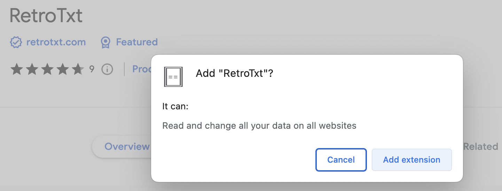

!!! note inline end "Why does RetroTxt require Read and change all data permissions?"
    { loading=lazy }

    The short answer is that it doesn't, which is a limitation of the web extension permissions. RetroTxt ignores all websites except those you tell it to monitor in the background.

    [If you're in a corporate environment or security conscious, after installation, you can fine-tune your browser to further lockdown RetroTxt](usage/secure.md).

  

 

 &nbsp; [Install on Chrome :material-google-chrome:](https://chrome.google.com/webstore/detail/retrotxt/gkjkgilckngllkopkogcaiojfajanahn){ .md-button .md-button--primary } &nbsp; [Install on Edge :material-microsoft-edge:](https://microsoftedge.microsoft.com/addons/detail/hmgfnpgcofcpkgkadekmjdicaaeopkog){ .md-button } &nbsp; [Install on Firefox :material-firefox:](https://addons.mozilla.org/en-US/firefox/addon/retrotxt){ .md-button }

---

# RetroTxt

Turn pieces of ANSI, ASCII, and NFO documents into HTML. RetroTxt is the browser Extension that takes legacy and plain text files and stylizes them into a more acceptable, valid format to view or copy from a web browser tab.

- [x] View ANSI, ASCII, NFO, Shift JIS text art as HTML
- [x] View server, system, and dev-op logs styled with colored text
- [x] View BBS colored text files for Celerity, PC Board, Renegade, Telegard, Wildcat!, WVIV systems

## Screenshots

=== "Showcase"

    <figure markdown>
      
      <figcaption>View ANSI colored text in a browser</figcaption>
    </figure>

=== "Raw text"

    <figure markdown>
      
      <figcaption>Toggle back to the raw text view</figcaption>
    </figure>

=== "Fonts"

    <figure markdown>
      
      <figcaption>Choose from hundreds of fonts to style ASCII texts</figcaption>
    </figure>

=== "Display"

    <figure markdown>
      
      <figcaption>Descriptive and simple to use options</figcaption>
    </figure>

=== "Extra info"

    <figure markdown>
      
      <figcaption>Optional, extra details for each text file</figcaption>
    </figure>

=== "Text editor"

    <figure markdown>
      
      <figcaption>Copy the output of RetroTxt and paste it into a standard text editor</figcaption>
    </figure>

* ### Swappable palettes for different color simulations VGA, CGA, Unix xterm, Apple IIgs, Commodore 64, monochrome and switchable iCE Colors
* ### Customizable font and background colors
* ### SAUCE metadata parsing
* ### Support for multiple text encodings MS-DOS CP-437, Amiga ISO-8959-1, Windows 1252, Japanese Shift-JIS
* ### Automatic fixes for block character and line artifacts
* ### Hundreds of IBM PC font choices VGA, EGA, CGA, MDA, PS/2, and more
* ### Various Amiga and microcomputer fonts From Commodore, Atari, Apple, Tandy, and more
* ### Open-source

---