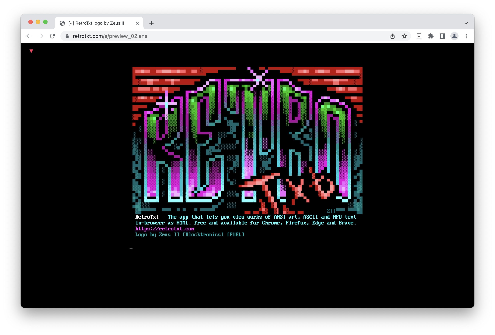
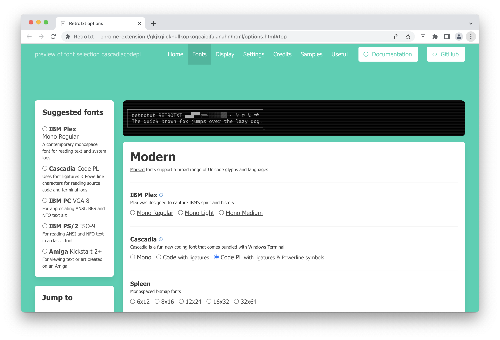
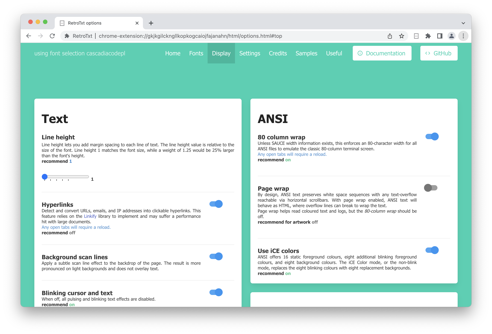
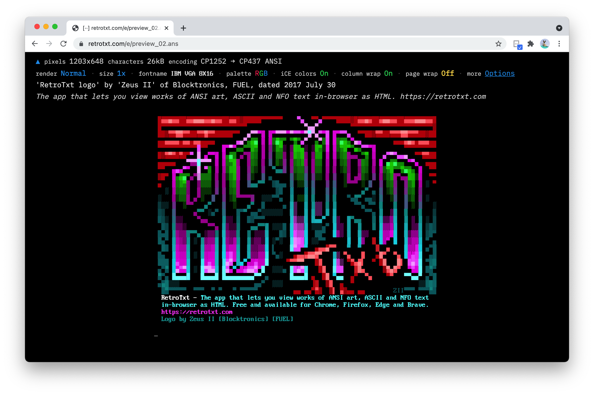

# RetroTxt

  

 

-   :material-google-chrome:{ .lg .middle } __Chrome__

    ---

    Install from the chrome web store for all compatible browsers

    [:octicons-arrow-right-24: Install](https://chrome.google.com/webstore/detail/retrotxt/gkjkgilckngllkopkogcaiojfajanahn)

-   :material-microsoft-edge:{ .lg .middle } __Edge__

    ---

    Install from the Microsoft Edge Add-ons

    [:octicons-arrow-right-24: Install](https://microsoftedge.microsoft.com/addons/detail/hmgfnpgcofcpkgkadekmjdicaaeopkog)

-   :material-firefox:{ .lg .middle } __Firefox__

    ---

    Install from the Firefox Add-ons using an older version of RetroTxt

    [:octicons-arrow-right-24: Install](https://addons.mozilla.org/en-US/firefox/addon/retrotxt)

-   :material-github:{ .lg .middle } __Open Source, LGPL-3.0__

    ---

    RetroTxt is licensed under [LGPL](https://github.com/bengarrett/RetroTxt/blob/main/LICENSE) and available on [GitHub](https://github.com/bengarrett/RetroTxt)

    [:octicons-arrow-right-24: Repository](https://github.com/bengarrett/RetroTxt)

### Turn pieces of ANSI, ASCII, and NFO documents into a web document <small>RetroTxt is the Extension that takes legacy and plain text files and correctly stylizes them for viewing or copying from a browser tab</small>

- [x] View ANSI, ASCII, NFO, Shift JIS text art as a web document
- [x] View server, terminal, and DevOps logs styled with colored text
- [x] View BBS colored text files for Celerity, PC Board, Renegade, Telegard, Wildcat!, WVIV systems

---

## Screenshots

=== "Showcase"

    <figure markdown>
      
      <figcaption>View ANSI colored text in a browser</figcaption>
    </figure>

=== "Raw text"

    <figure markdown>
      
      <figcaption>The original, raw text view</figcaption>
    </figure>

=== "Fonts"

    <figure markdown>
      
      <figcaption>Choose from hundreds of fonts to style texts</figcaption>
    </figure>

=== "Display"

    <figure markdown>
      
      <figcaption>Descriptive and simple to use options</figcaption>
    </figure>

=== "Extra info"

    <figure markdown>
      
      <figcaption>Optional extra details for each text file</figcaption>
    </figure>

=== "Text editor"

    <figure markdown>
      
      <figcaption>Copy the output of RetroTxt and paste it into a standard text editor</figcaption>
    </figure>

---

## Features

!!! question inline end "Why does RetroTxt require Read and change all data permissions"
    { loading=lazy }

    The short answer is that it doesn't, which is a limitation of the web extension permissions. RetroTxt ignores all websites except those you tell it to monitor in the background.

    [If you're in a corporate environment or security conscious, after installation, you can fine-tune the browser to further lockdown RetroTxt](usage/secure.md).

* ### Swappable palettes for different color simulations <small>VGA, CGA, Unix xterm, Apple IIgs, Commodore 64, monochrome and switchable iCE Colors</small>
* ### Customizable font and background colors
* ### SAUCE metadata parsing
* ### Support for multiple text encodings <small>MS-DOS CP-437, Amiga ISO-8959-1, Windows 1252, Japanese Shift-JIS</small>
* ### Automatic fixes for block character and line artifacts
* ### Hundreds of IBM PC font choices <small>VGA, EGA, CGA, MDA, PS/2, and more</small>
* ### Various Amiga and microcomputer fonts <small>From Amstrad, Atari, Apple, Commodore, Tandy, and many more</small>

---