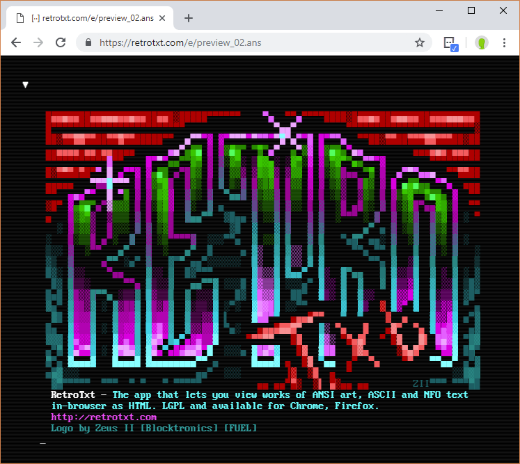

## RetroTxt

Turn many pieces of ANSI text art and ASCII/NFO plain text into HTML5 text using
RetroTxt. The browser agnostic WebExtension that takes retro text files and
stylises them into a more pleasing, useful format to view and copy in a web browser.

#### Available for installation from the [Chrome web store](https://chrome.google.com/webstore/detail/retrotxt/gkjkgilckngllkopkogcaiojfajanahn), [Firefox Add-ons](https://addons.mozilla.org/en-US/firefox/addon/retrotxt/) and [Microsoft Edge Addons](https://microsoftedge.microsoft.com/addons/detail/hmgfnpgcofcpkgkadekmjdicaaeopkog).

### Support

- [README with installation instructions](https://github.com/bengarrett/RetroTxt#readme)
- [Limitations and known issues](limitations)
- [FAQ - Common questions and fixes](SUPPORT)

### Documentation

- [Options menu](options)
- [Page and toolbar menus](menus)

* [Source code and how to use it](source_code)

- [Similar tools and projects](other_projects)

* [Technical specifications on supported formats](technical)
* [Version changes](changes)

### Dev-ops

- [Configure NGINX to serve ASCII & ASCII art](nginx)

### Policies

- [Privacy policy](privacy) / [Security policy](SECURITY)
- [Code of conduct](https://github.com/bengarrett/RetroTxt/blob/master/docs/CODE_OF_CONDUCT.md)

* [Contributing documentation or code](https://github.com/bengarrett/RetroTxt/blob/master/docs/CONTRIBUTING.md)
* [License](https://choosealicense.com/licenses/lgpl-3.0/)

---

