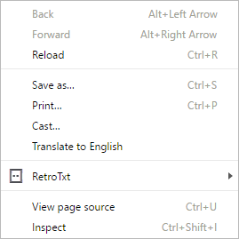
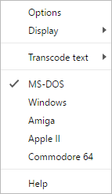
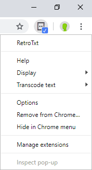
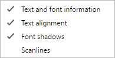
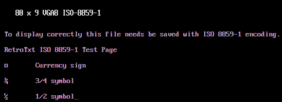
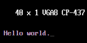
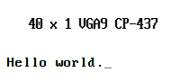
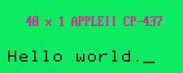

# RetroTxt

## Toolbar button and context menus

The context menu can be found by right-clicking on the active tab (web page) content, and also in Chrome by right-clicking the RetroTxt toolbar button.

Active tab context menu

Chrome toolbar context menu

### Options

Launch the RetroTxt [Options dialogue](options.md).

#### Display

##### Text and font information

Apply the text and font information header detailing the document metadata and font information.

##### Text alignment

Positions the text document from the left-top margin to the centre the of the display.

##### Scan lines

Apply a subtle scan line effect to the background of the page. The effect is more pronounced on light backgrounds but is not applied to the text.

#### Transcode text

Character encoding is complicated and the execution not always precise. If you encounter text that is not displaying as expected, you can transcode the text to display a different set of characters. Transcode text selections only apply to the active browser tab.

A text document with the correct character encoding

The same document with the incorrect transcoding

##### Guess (default)

The default behaviour, this lets RetroTxt try to determine the base character encoding of the text and when needed, apply any transcoding.

##### + Windows 1252

Force the active tab to parse the text using **CP-1252** encoding as the browser source.

##### + ISO 8895-5

Force the active tab to parse the text using **ISO 8895-5** encoding as the browser source.

##### > Windows legacy web

Force the active tab to display the text using **Windows-1252** _Code Page 1252_ which was commonly used by legacy Microsoft Windows systems_

##### > Linux legacy web

Force the active tab to display the text using **ISO-8859-15** _ISO-8859 Part 15_ which was the recommended encoding for Linux and the web during the 2000s.

##### > None

Force the active tab not to transcode. Aforementioned can be used to make documents encoded in **UTF-8** or **ISO-8859-1** to display.

**UTF-8** is the most common, contemporary code set to encoded Unicode text (including Emojis) and it is nearly always in use with HTML5. **ISO-8859-1** was the original code set used by Linux, the Commodore Amiga and online during the 1990s. It is near identical to _ISO-8859-15_ but lacks a few European-centric characters such as the € sign.

### MS-DOS

Applies a 1-bit (2 colours) theme and VGA 8px font to all browser tabs that mimics the IBM-PC/MS-DOS grey text on a black background.

### Windows

Applies a 1-bit (2 colours) theme and VGA 9px font to all browser tabs that mimics the Windows 9x era notepad.exe black text on a white background.

### Amiga

Applies a 1-bit (2 colours) theme and font to all browser tabs that mimics the Commodore Amiga Workbench white text on a grey background.

### Apple II

Applies a 1-bit (2 colours) theme and font to all browser tabs that mimics the Apple II DOS screen black text on a green background.

### Atari ST

Applies a 1-bit (2 colours) theme and font to all browser tabs that mimics the ATARI ST TOS screen black text on a white background.

### Commodore 64

Applies a 1-bit (2 colours) theme and font to all browser tabs that mimics the Commodore 64 load screen blue text on a dark blue background.

### Help

Opens a new browser tab and loads the [README hosted on GitHub](https://github.com/bengarrett/RetroTxt/blob/master/README.md).
