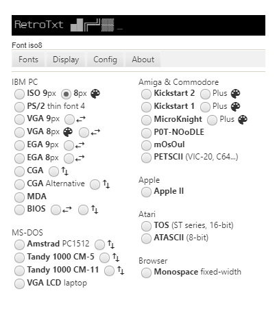
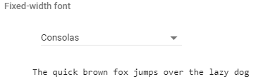
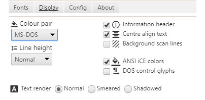
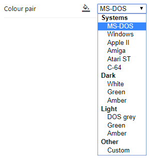
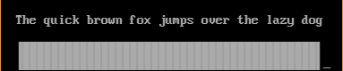
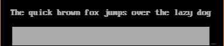
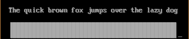
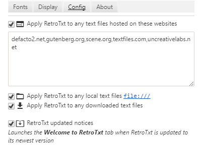

# RetroTxt

## Options

The Options dialogue lets you select a wide variety of font, colour and size combinations that RetroTxt will use when theming text in the browser. As well as a number behaviour configurations, to automate the execution of RetroTxt when it encounters text files.

In Chrome, you launch the Options dialogue by right-clicking the RetroTxt toolbar button and selecting __Options__.

With Firefox the Options dialogue is accessed from the Extensions tab.
To do this, in a new tab enter the address `about:addons` and select **Extensions**.
Then click the Options button under the RetroTxt listing.

### Fonts

RetroTxt has 25 different monospaced font choices to apply to text. Some fonts have `⇆` wide and `⇅` tall variants.
Those listed in the left pane are IBM PC, IBM PS/2 and Microsoft DOS system fonts while the ones on the right belong to other home computer systems.

The _Browser_ __Monospace__ _fixed-width_ selection uses a monospace font configured by the browser. This font selection is selectable within the browser under the _font_ settings.

### Display

### Colour pair

The Colour pair menu allows you to apply colour to text and a background theme to all characters handled by RetroTxt.
These pairs are also base colours for colourising ANSI text.

The ordered choices are in three categories. __Systems__ are recreations of ancient computer operating systems.
__Dark__ and __Light__ correspond to colours used on either a black (Dark) or white (Light) background.

The RGB values of these colour pairs are in the source code `\css\text-colors.css`

- **MS-DOS** uses VGA grey text on black.
- **Windows** is themed on the `notepad.exe` program and uses black text on white.
- **Apple II** based on the Apple home computer.
- **Amiga** based on the Commodore Amiga Workbench with white text on grey.
- **Atari ST** based on the Atari TOS with black text on white.
- **C-64** based on the Commodore 64 boot screen with a light on a dark blue colour pair.

     

### Line height

Line height lets you add padding to each line of text. The amount of padding used is dependent on the size of the font.
A **25%** line height would introduce padding 1/4 of the height of the font.
A **1x** (100%) value would pad the same height as the font in use.

### Information header

When styling text RetroTxt injects a text header detailing the document metadata and font information.
You can hover the mouse over its text for a brief description of each value.

`▲ ▼`

The up triangle will hide the information header while the down triangle will display it.

`640x544`

These are the _width_ x _length_ values.
Width is the number of pixels used from left to right.
Length is the number of pixels used from top to bottom.

`26.2kB`

Is the number of characters contained in the text measured as a decimal unit.

`CP1252`

Is the document character encoding set by the browser.

`CP437`

Is the character encoding used to display the document.
Character encoding is a complicated subject and the execution not always precise.
If you encounter text that is not showing the expected characters, you can transcode the document to apply a different set of characters and its technical name will be displayed here.

- **CP437** IBM/MS-DOS Code Page 437
- **CP1252** Code Page 1252 commonly used in legacy Microsoft Windows systems
- **ISO8859-1** ISO-8859 Part 1: Latin alphabet No. 1 alternatively known as ECMA-94
- **ISO8859-5** ISO-8859 Part 5: Latin alphabet No. 5
- **ISO8859-15** ISO-8859 Part 15: Latin alphabet No. 9
- **UTF-8** Universal Coded Character Set 8-bit
- **US-ASCII** Plain text, alternatively known as ASA X3.4, ANSI X3.4, ECMA-6, ISO/IEC 646

`VGA8`

Is the font name used.

#### Additional information may include

`ANSI`

Unique controls or functions embedded into the text. ANSI art, for example, uses ANSI control sequences while ASCII art doesn't use any extra controls.

- **ANSI** ECMA-48/ANSI X3.64 presentation control and cursor functions
- **PCBoard** PCBoard BBS text colourisation
- **Wildcat!** Wildcat! BBS text colourisation

`1 unknown control found`

Highlights any errors or warnings encountered when parsing ANSI encoded text.

[SAUCE metadata](http://www.acid.org/info/sauce/sauce.htm) may also be in the header.
_Standard Architecture for Universal Comment Extensions_ is often found in ANSI art but can be attached to any document and allows the author to include titles, dates, comments and affiliations.

### Centre align text

Positions the text document from the left-top margin to the centre the of the display.

### ANSI 80 column wrap

Enabled by default, this enforces an 80 column (characters) width limit for all ANSI files, unless [SAUCE](http://www.acid.org/info/sauce/sauce.htm) width information exists.

Legacy artworks often expect an 80x25 character terminal screen and don't include proper newline characters or positioning information.

### ANSI iCE colors

Default ANSI offers 16 static foreground colours, eight blinking foreground colours and eight background colours.

The _iCE Color mode_ also called the _non-blink mode_ removes the eight blinking colours and replaces them with an extra eight backgrounds to offer 16 static foreground and 16 background colours.

### DOS control glyphs

The PC/MS-DOS _Code Page 437_ is not entirely standards compliant as it uses C0 characters usually reserved for common formatting controls to display character glyphs.
As such these characters are never displayed but enabling this option will reveal these glyphs in the text document.

◘ <small>_= backspace_</small>
○ <small>_= tab_</small>
♪ <small>_= carriage return_</small>
→ <small>_= end of file_</small>
⌂ <small>_= delete_</small>

### Background scanlines

Apply a subtle scan line effect to the backdrop of the page. The result is more pronounced on light backgrounds and ignores the text.

### Text render

#### Normal

Lets the host operating system or browser handle the font smoothing.

##### Smeared

Due to font smoothing, many browsers display vertical line artefacts when showing block characters together. This option implements a `text-shadow` property in an attempt to correct this but it also blurs alphanumeric characters to make them less readable.

##### Shadowed

Apply a subtle shadow effect to each character.

## Config

### Apply RetroTxt to any text files hosted on these websites

If check the WebExtension runs in the background and applies RetroTxt to all text files served by websites listed in the textbox.
You can add additional sites to this list by including their domain name appended by a semicolon, for example.

- [Defacto2](https://defacto2.net) `defacto2.net;`
- [Gutenberg.org](https://www.gutenberg.org) `gutenberg.org;`
- [Scene.org](https://www.scene.org) `scene.org;`

`defacto2.net;gutenberg.org;scene.org;`

Erasing the textbox content will reset the website list to the RetroTxt defaults.

### Apply RetroTxt to any local text files

Web browsers can load and display documents stored in a computer file system using the [`file:///`](file:///) protocol.
With this option checked the WebExtension runs in the background.
It applies RetroTxt to all text files that are served using the [`file:///`](file:///) protocol, allowing you to use RetroTxt as an offline NFO, ANSI and ASCII viewer.

### Apply RetroTxt to any downloaded text files

With this option, the WebExtension will monitor all your file downloads to attempt to apply RetroTxt to all saved text.
It is the browser that determines which files are binary or text so the results could be wrong.

Firefox does not support the feature.
