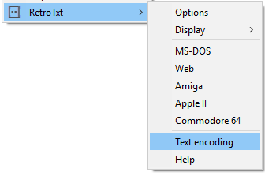

## Q.A.

#### Can I adjust the size of the font?

You can adjust the _zoom_ of the font by using the <kbd>Ctrl</kbd> <kbd>+</kbd> and <kbd>Ctrl</kbd> <kbd>-</kbd> keys.

#### Can I view files stored on my computer?

By typing a path into the address bar, many browsers are quite happy to read files and directories stored locally on your computer.

On Windows, for example, pasting `C:\Users\Ben\Downloads\myfile.txt` into Chrome or Firefox will convert it to into a browser-friendly file URI and view the document in the browser.
```
file:///C:/Users/Ben/Downloads/myfile.txt
```

You can also [browse your Windows drive](file:///C:/) or [your Linux and OSX drives](file:///).

Chrome will need [__Allow access to the file URLs__ permission](chrome://extensions/) enabled if you want the feature to automatically work with local files.

<small>To make a browser your default text file viewer in Windows. Right-click on your desktop and choose __text file__ under __New__. This creates the file `New Text Document.txt`. Right-click on the file, select __Choose another app__ (_Choose default program..._ in Windows 7) under __Open with__ item. Then under __Other options__ scroll down and select your browser.</small>

#### Are the fonts and styling historically accurate?
Somewhat but it depends on.

* The extension is English-centric, focusing on [CP-437](https://msdn.microsoft.com/en-us/goglobal/cc305156.aspx), [ISO 8850-15](https://msdn.microsoft.com/en-us/goglobal/cc305176) and [Windows 1252](https://msdn.microsoft.com/en-us/goglobal/cc305145) code page support. Text files written for other languages may not render.

* The extension uses TrueType fonts which are affected by the operating system's font smoothing effects; ClearType on Windows, Quartz in macOS and FreeType on Linux.

* A number of fonts were designed for 40 columns (characters per line of text) but the extension doesn't enforce that limitation.

* The web browser and the operating system can make modifications the font width, height, and space for either accessibility or due to user applied themes.

* The Apple II, Commodore Amiga, Commodore 64, VGA LCD fonts were a bit small and have been up-sized by 1.5x. You can return these fonts to their original size by pressing <kbd>Ctrl</kbd> <kbd>-</kbd> in Chrome and reducing the font size to _67%_.

#### What text encodings are supported?
1. UTF-8 Unicode
- ISO/IEC 8859-15*
- Windows 1252
- MS-DOS code page 437
- ASCII-1967/US-ASCII <small>(American English legacy text)</small>

<small>* The Commodore Amiga uses 1987 era ISO 8859-1, it's very close to the [ISO 8859-15](https://en.wikipedia.org/wiki/ISO/IEC_8859-15) of 1999</small>

#### Text is garbled
There could be a number of causes of this but generally it is related to the web server or browser choosing the incorrect character encoding for the file.

You can manually switch this.

In __Chrome__ click the menu icon  and select __Encoding__ from the __More tools__ menu.

In __Firefox__ press <kbd>ALT</kbd> <kbd>v</kbd> and select __Text Encoding__.

Choose a more suitable character encoding, but if you are not quite sure which one to use and you know the document is in English. First, try the __Unicode (UTF-8)__ then each of the other __Western__ options.

You could also disable RetroTxt character encoding conversion by right-clicking on the page and select __Text encoding__ from the __RetroTxt__ context menu.




#### Dependencies & tested systems

- Depends on JavaScript [Template literals](https://developer.mozilla.org/en-US/docs/Web/JavaScript/Reference/Template_literals) introduced in Chrome 41.
- Uses the [V2 Options page](https://developer.chrome.com/extensions/optionsV2) introduced in Chrome 40.
- Firefox 45 introduced WebExtensions support but RetroTxt [does not run correctly in Firefox 45-48](https://developer.mozilla.org/en-US/Add-ons/WebExtensions/Chrome_incompatibilities).

Tested on [Chrome](https://www.google.com/intl/en/chrome/browser/desktop/index.html) for Windows,
[Firefox](https://www.mozilla.org/en-GB/firefox/products/) on Windows and Linux, [Chromium](https://www.chromium.org/Home) on Linux, [ChromeOS](https://www.chromium.org/chromium-os), [Opera](https://www.opera.com/) for Windows

#### Code page tables
- [ASCII codes](http://www.ascii-codes.com/)
- [ASCII-1967/US-ASCII](http://0x6a.org/ASCII)
- [CP-437](https://msdn.microsoft.com/en-us/goglobal/cc305156)
- [ISO 8859-1](https://msdn.microsoft.com/en-us/goglobal/cc305167)
- [Windows 1252](https://msdn.microsoft.com/en-us/goglobal/cc305145)
- [Unicode](http://unicode-table.com/)
