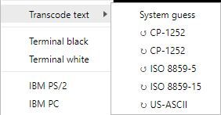

# RetroTxt - Q.A.

To ask a question, report a bug or request a feature please feel free to [leave a new issue](https://github.com/bengarrett/RetroTxt/issues) on the GitHub repository or get in contact with [@bens_zone](https://twitter.com/bens_zone) on Twitter and [mail](mailto:code.by.ben@gmail.com).

- [Can I adjust the size of the font?](#font-size)
- [Can I view files stored on my computer?](#view-files)
- [What are the text encodings supported?](#text-encodings)
- [Garbled text?](#garbled)
- [Code page tables](#cp-tables)

## Can I adjust the size of the font?

You can change the _zoom_ of the font by using the <kbd>Ctrl</kbd> <kbd>+</kbd> and <kbd>Ctrl</kbd> <kbd>-</kbd> keys.

## Can I view files stored on my computer?

By typing a path into the address bar, many browsers are quite happy to read files and directories stored locally on your computer.

On Windows, for example, pasting `C:\Users\Ben\Downloads\myfile.txt` into Chrome, Brave, Edge and Firefox will convert it to into a browser-friendly file URI and view the document in the browser.

`file:///C:/Users/Ben/Downloads/myfile.txt`

You can also [browse your Windows drive](file:///C:/) or [your Linux and macOS drives](file:///).

The feature is enabled in the **Options** > **Config** by either having the _Apply RetroTxt to any local text files_ or _Apply RetroTxt to any
downloaded or local text files_ selection checked. Chrome, Brave and Edge will also need to [**Allow access to the file URLs** permission](chrome://extensions/) enabled if you want it to work with local files automatically.

Follow these instructions to make a web browser your default text file viewer in Microsoft Windows.

1. Right-click on the desktop and choose **text file** under **New** to create the file `New Text Document.txt`
1. Right-click on the file, select **Choose another app** (_Choose default program..._ in Windows 7) under **Open with** item
1. Then under **Other options** scroll down and choose your browser

## What are the text encodings supported?

Please see [Technical Specifications on the supported text](technical).

## Garbled text?

There could be many causes of this, but generally, it is related to the web server or browser choosing the incorrect character encoding for the file.

In the **Firefox** browser, press <kbd>ALT</kbd> <kbd>v</kbd> and select **Text Encoding**.

Choose a more suitable character encoding but if you are not quite sure which one to use but the document is in English. First, try the **Unicode (UTF-8)** then each of the other **Western** options.

Without using a 3rd-party WebExtension, **Chrome**, **Brave** and **Edge** cannot switch the character encoding.

You could also try to manually switch the transcoding RetroTxt applies by right-clicking on the page and select **Transcode text** from the **RetroTxt** context menu.

## Code page tables

- [ASCII codes](http://www.ascii-codes.com/)
- [ASCII-1967/US-ASCII](http://0x6a.org/ASCII)
- [CP-437](https://msdn.microsoft.com/en-us/goglobal/cc305156)
- [ISO 8859-1](https://msdn.microsoft.com/en-us/goglobal/cc305167)
- [Windows 1252](https://msdn.microsoft.com/en-us/goglobal/cc305145)
- [Unicode](http://unicode-table.com/)

## [Limitations and known issues](limitations)
