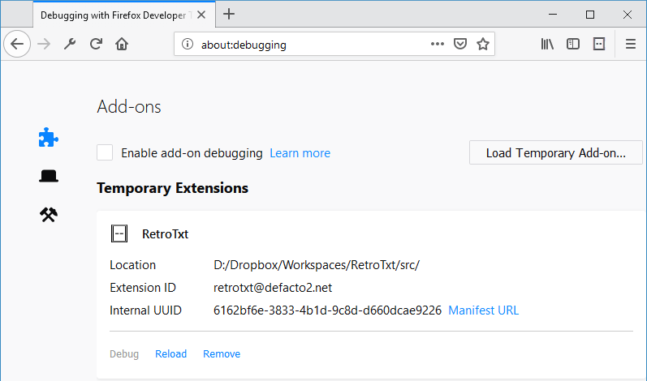
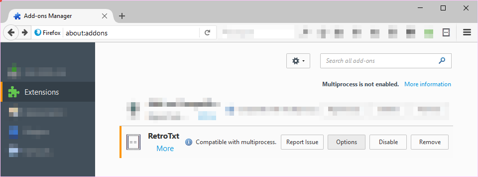

# RetroTxt

# Source code

RetroTxt employs an [open sourced license](https://choosealicense.com/licenses/lgpl-3.0/) with the complete source code available on [GitHub](https://github.com/bengarrett/RetroTxt). This page instructs on how to use the source in both Chromium based and Firefox web browsers.

[Visual Studio Code](https://code.visualstudio.com) is used to create RetroTxt, and so it has some `.vscode` conveniences included in the package such as Tasks and extension recommendations.

The source code also depends on [Node.js](https://nodejs.org) with [NPM](https://www.npmjs.com) for some linting and build tools.

## Download

Download the RetroTxt source code onto your local computer.

Either by using [this GitHub link](https://github.com/bengarrett/RetroTxt/archive/master.zip) and decompress the saved `RetroTxt-master.zip`.

Or run the following command in a terminal.

`git clone https://github.com/bengarrett/RetroTxt.git`

## Install tools with NPM

`cd RetroTxt`

`npm install`

`npm run version`

## Use on Chrome and Chromium

I suggest that you create a new user profile in Chrome and use that to load and edit this WebExtension.

1.  Open a new tab and type in the address

- Chrome/Chromium: `chrome://extensions`
- Brave: `brave://extensions`
- Edge: `edge://extensions`

1.  In the Extensions tab, toggle **Developer mode**
1.  Click the **Load unpacked** button
1.  Navigate to the local directory containing the RetroTxt source code and select OK

RetroTxt should load. The [Options link](options.md) behind the **Details** button and allows you to configure RetroTxt styling and behaviour.

## Use on Firefox

Firefox is locked down and doesn't permit the loading of extensions outside of the Firefox Add-ons page.

Instead, there are two options to use the source code. Either use Mozilla's terminal tool `web-ext` or use [Firefox Developer Edition](https://www.mozilla.org/en-US/firefox/developer/).

The web-ext tool is the preferred method and [has a dedicated web page](https://developer.mozilla.org/en-US/Add-ons/WebExtensions/Getting_started_with_web-ext) but requires node.js. It allows you to lint, run with options or build RetroTxt in Firefox.

1. [Install Node.js if needed](https://nodejs.org)
1. `cd RetroTxt` into the cloned directory
1. `copy manifest_firefox.json manifest.json`
1. `npm install` to install web-ext
1. `npm run firefox` to load RetroTxt in Firefox
1. [Read more about web-ext](https://developer.mozilla.org/en-US/Add-ons/WebExtensions/Getting_started_with_web-ext)

## Use on Firefox Developer Edition

1.  Open a new tab and type in the address `about:debugging`
1.  Click the **Load Temporary Add-on** button and navigate to the local directory containing the RetroTxt source code
1.  Open the `manifest.json` file to load RetroTxt

Now in the same tab.

1.  Type in the address `about:addons`
1.  Select **Extensions**
1.  RetroTxt should be listed there with some including **Options**
1.  The [Options button](options.md) allows you to configure RetroTxt styling and behaviour

