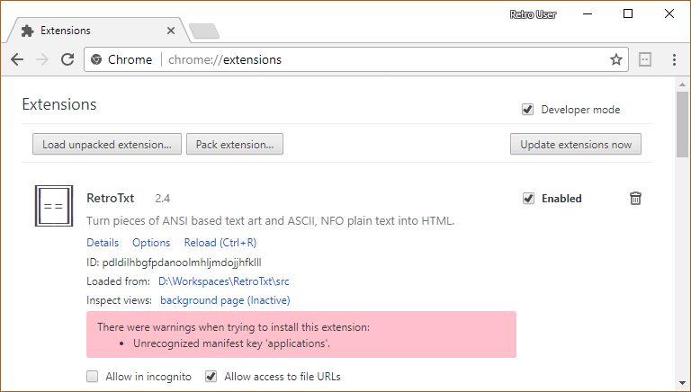

# RetroTxt - Source code

RetroTxt employs an [open sourced license](https://choosealicense.com/licenses/lgpl-3.0/) with the complete source code available on [GitHub](https://github.com/bengarrett/RetroTxt). This page instructs on how to use the source in both Chromium based and Firefox web browsers.

- [Download](#download)
- [Install programming and build tools with Yarn](#install-yarn)
- [Use on Chrome and Chromium](#chrome)
- [Use on Firefox](#firefox)
- [Use on Firefox Developer Edition](#firefox-dev)
- [Directory and file structure](#directories)

[Visual Studio Code](https://code.visualstudio.com) is used to create RetroTxt, and so it has some `.vscode` conveniences included in the package such as workspace settings and extension recommendations.

There are also [Node.js](https://nodejs.org) with [yarn](https://yarnpkg.com/) dependencies for the programming and build tools.

The source code is linted with [ESLint](https://eslint.org/) and stylised using [Prettier](https://prettier.io/), an opinionated formatter.

<a id="download"></a>

## Download

Download the RetroTxt source code onto your local computer.

Either by using [this GitHub link](https://github.com/bengarrett/RetroTxt/archive/master.zip) and decompress the saved `RetroTxt-master.zip`.

Or run the following [Git](https://git-scm.com/) command in a terminal.

```sh
git clone https://github.com/bengarrett/RetroTxt.git
```

<a id="install-yarn"></a>

## Install build dependencies with yarn

```sh
cd RetroTxt
yarn
```

If the installation of the tools is successful, this command should return the `web-ext` version number.

```sh
yarn run web-ext --version
```

### Convert and compact a Truetype font into WOFF2 for use by RetroTxt.

_Windows users may need to edit `package.json` and update `"scripts": { "font": "woff2_compress.js.cmd" }`_

```sh
yarn run font fonts/monafont/mona.ttf mona.woff2
```

### Run RetroTxt in **Firefox** with automatic extension reloading.

For this to work [Firefox needs to be installed](https://www.mozilla.org/en-US/firefox/) on your computer and then RetroTxt on Firefox will reload whenever a change is made to this source code.

```sh
cp manifest_firefox.json manifest.json
yarn run web-ext run
```

### Analyse the source code for any errors using Mozilla's web-ext lint tool.

```sh
cp manifest_firefox.json manifest.json
yarn run web-ext lint
```

<a id="chrome"></a>

## Use on Chrome, Edge, Brave and Chromium

I suggest that you create a [new user profile](https://support.google.com/chrome/answer/2364824?co=GENIE.Platform%3DDesktop&hl=en) for use and to edit the WebExtension.

Open a new tab and type in the address of the extension.

- Chrome and Chromium: `chrome://extensions`
- Edge: `edge://extensions`
- Brave: `brave://extensions`

1.  In the Extensions tab, toggle **Developer mode**
1.  Click the **Load unpacked** button
1.  Navigate to the local directory containing the RetroTxt source code and select OK




RetroTxt should load. The [Options link](options) behind the **Details** button and allows you to configure RetroTxt styling and behaviour.

<a id="firefox"></a>

## Use on Firefox

Firefox is locked down and doesn't permit the loading of extensions outside of the Firefox Add-ons page.

Mozilla's `web-ext` tool is the easiest method to bypass this with a [dedicated web page](https://developer.mozilla.org/en-US/Add-ons/WebExtensions/Getting_started_with_web-ext) but requires Node.js.

1. [Install Node.js if needed](https://nodejs.org)
1. `cd RetroTxt` into the cloned RetroTxt directory
1. `yarn` to install web-ext and dependencies
1. `yarn run web-ext run` to load RetroTxt in Firefox with automatic extension reloading


<a id="firefox-dev"></a>

## Use on Firefox Developer Edition

1. Edit `web-ext-config.js`
1. Update `"run": { "firefox": "firefox" }` and change it to `"run": { "firefox": "firefoxdeveloperedition" }`
1. Follow the above **Use on Firefox** instructions

<a id="directories"></a>

## Directory and file structure

These are the root directories and files that comprise of RetroTxt. With critical subdirectories and sub-files also pointed out.

- `.vscode` Workspace settings for [Visual Studio Code](https://code.visualstudio.com/)
- `_locales` Spelling differences for the UK and US English.
- - `/en_US/messages` Also include shared variables for remote URLs and BBS software names.
- `assets` Images used by the `README.md`, `/html/welcome.html` and other resources.
- `css` WebExtension cascading style sheets in CSS3 syntax.
- - `layout.css` Base elements styles.
- - `retrotxt.css` Fonts, scanlines, and cursor stylings.
- - `text_colors.css` Text theme combinations.
- - `text_ecma_48.css` ANSI Select Graphic Rendition function classes.
- - `text_colors_4bit.css` ANSI Select Graphic Rendition colour classes.
- - `text_colors_4bit-ice.css` ANSI Select Graphic Rendition iCE Color classes.
- - `text_colors_vga.css` Standard VGA 16 colours for ANSI colour classes.
- - `text_colors_xterm.css` xterm 16 colours for ANSI colour classes.
- - `text_colors_8bit.css` xterm 256 colours for ANSI colour classes.
- - `text_colors_bbs.css` BBS colours and font styles.
- - `text_colors_pcboard.css` PCBoard BBS colour classes.
- `fonts` Original fonts with their documentation and licences.
- - `/woff2` [Compressed TrueType/OpenType fonts](https://developer.mozilla.org/en-US/docs/Web/Guide/WOFF) used by RetroTxt.
- `html` WebExtension HTML5 templates for the Options dialogue and the welcome load page.
- `libs` JavaScript dependencies that cannot be installed using [yarn](https://yarnpkg.com/).
- - `/tippyjs` [A tooltip and popover provider](https://atomiks.github.io/tippyjs/) that is used by the welcome load page.
- `md` Changes document in [GitHub Flavored Markdown](https://guides.github.com/features/mastering-markdown/) and README assets.
- `scripts` WebExtension JavaScripts in ES6+ (ES2015) syntax.
- - `eventpage.js` Background functions and listeners that are completely isolated from all other scripts.
- - `functions.js` Shared functions accessible to non-isolated scripts.
- - `options.js` Isolated functions for the Options dialogue template located at `/html/options_*.html`.
- - `parse_ansi.js` Functions to handle ANSI and ECMA-48 controls.
- - `parse_dos.js` Functions to handle text encodings and DOS code pages.
- - `retrotxt.js` Invokes RetroTxt, handles the browser page display and SAUCE metadata.
- - `welcome.js` Isolated functions for the welcome load page template located at `/html/welcome.html`.
- `test`
- - `/example_files` ASCII, BBS and ANSI text test cases for use with `files:///`
- - `index.html` Entry point for the [QUnit](https://qunitjs.com/) tests.
- - `tests-*.js` QUnit tests for the `/script/*.js` functions.
- `.eslintrc.js` [ESLint configuration file](https://eslint.org/docs/user-guide/configuring).
- `.eslintignore` [ESLint ignore file](https://eslint.org/docs/user-guide/configuring#ignoring-files-and-directories).
- `manifest.json` [WebExtension manifest file](https://developer.mozilla.org/en-US/docs/Mozilla/Add-ons/WebExtensions/manifest.json) containing read-only metadata and configuration options.
- `package.json` [NPM/yarn configuration file](https://docs.npmjs.com/files/package.json).
- `web-ext-chrome.js` [web-ext configuration file](https://developer.mozilla.org/en-US/docs/Mozilla/Add-ons/WebExtensions/Getting_started_with_web-ext#Setting_option_defaults_in_a_configuration_file) for packaging a Chrome distribution package.
- `web-ext-config.js` web-ext configuration file for packaging a Firefox distribution and all other web-ext commands.
