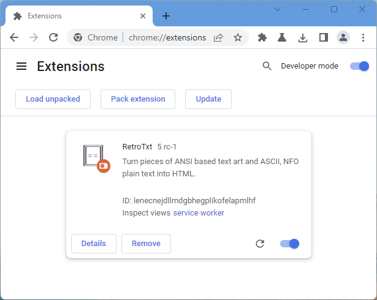

# Install and usage

This page instructs how to use and build the source code for Chrome or Edge.
RetroTxt employs a restrictive [open-sourced license](https://choosealicense.com/licenses/lgpl-3.0/) with the code available on [GitHub](https://github.com/bengarrett/RetroTxt).

!!! note ""
    [Visual Studio Code](https://code.visualstudio.com) is used to create RetroTxt.<br>It includes optional `.vscode` conveniences, such as workspace settings and extension recommendations.

**You'll require installing the following command line applications** to download and initialize the repository.

- [git](https://git-scm.com) <small>the distributed version control software</small>
- [Node.js](https://nodejs.org) <small>an open-source, cross-platform JavaScript runtime environment</small>
- [pnpm](https://pnpm.io) <small>an efficient package manager for Node.js</small>
- [Task](https://taskfile.dev) <small>a task runner / build tool that aims to be simpler and easier to use</small>

## Clone the repo

Download and copy the RetroTxt repository to the current directory.

```bash
git clone https://github.com/bengarrett/RetroTxt.git
```

## Install the dependencies

RetroTxt has a few third-party dependencies and tools for initialization in the repository.

```bash
# Change to the RetroTxt directory
cd RetroTxt

# Install the dependencies
pnpm install

# Initialize the RetroTxt Extension
task dep-install
```

## (optional) Edit the manifest file

Some may wish to edit the Extension manifest containing the base configuration, permissions, and metadata for RetroTxt.

```json
  "host_permissions": [
    "*://*.retrotxt.com/*",
    "https://*/",
    "http://*/",
    "file://*/"
  ],
```

The `RetroTxt/ext/manifest.json` file contains the configuration and metadata for RetroTxt.


## Run the source code

I suggest that you create a [new user profile](https://support.google.com/chrome/answer/2364824?co=GENIE.Platform%3DDesktop&hl=en) for the Extension.
Open a new tab with the address of the Extensions features.

!!! tip inline end ""
    The `chrome://extensions/` address will work in other browsers such as Edge

```
chrome://extensions/
```

1.  In the Extensions tab, toggle **Developer mode**
2.  Click the **Load unpacked** button
3.  Navigate to the directory containing the `RetroTxt/ext/` repository and select **OK**

RetroTxt should load, and the Extension reload button can apply source code changes.


