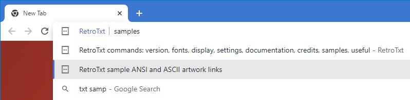

---
hide:
  - toc
---
You can test the installation of RetroTxt by selecting one of the many sample artworks found in the RetroTxt Samples tab. Or typing `txt samples` in an address bar.

<figure markdown>
  
  <figcaption>Omnibox txt samples command</figcaption>
</figure>

---

RetroTxt initially runs on these preconfigured websites and domains.

- [retrotxt.com](https://retrotxt.com) 
Hosts the texts and artworks linked in the Samples tab
- [http://localhost](http://localhost) 
Permits the use of local and simple HTTP servers
- [16colo.rs](https://16colo.rs) 
The primary hub of the ANSI and ASCII art communities
- [defacto2.net](https://defacto2.net) 
An extensive collection of computer underground text art and documents
- [gutenberg.org](https://www.gutenberg.org) 
The world's most comprehensive collection of public domain books in plain text and other formats
- [scene.org](https://scene.org) 
The primary file hosting service for the demo scene
- [textfiles.com](http://textfiles.com) 
An extensive text file collection from the early Internet and BBS era
- [uncreativelabs.net](http://uncreativelabs.net) 
Retro computing texts and files

---

You can change these sites in the RetroTxt Settings tab, under the Run RetroTxt on files hosted on these domains in Feature. 
Or typing `txt settings` in an address bar.