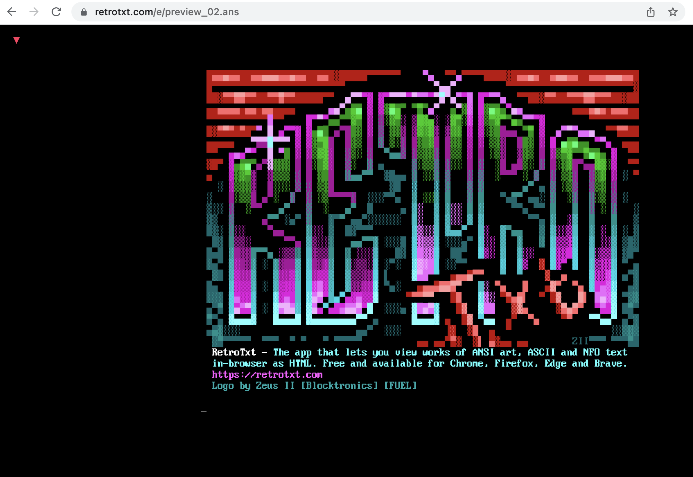
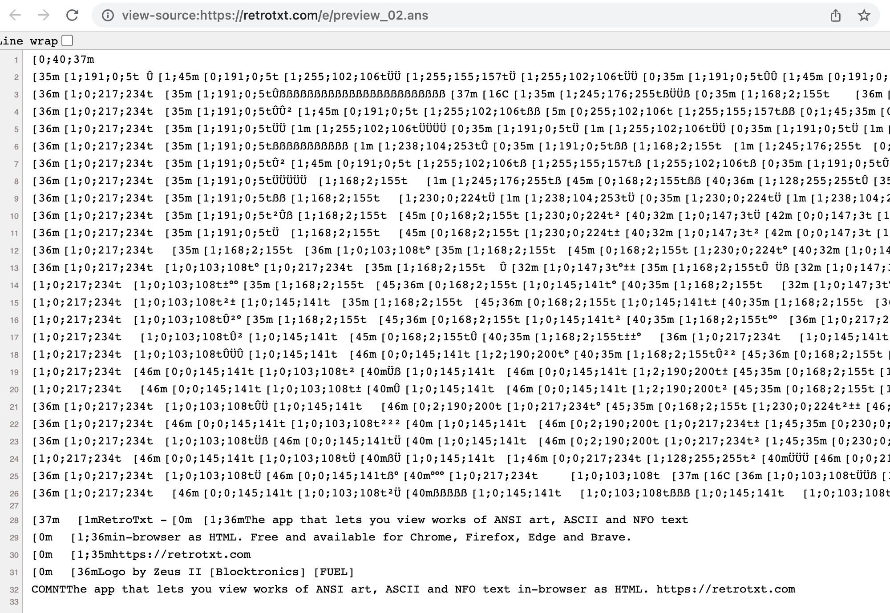
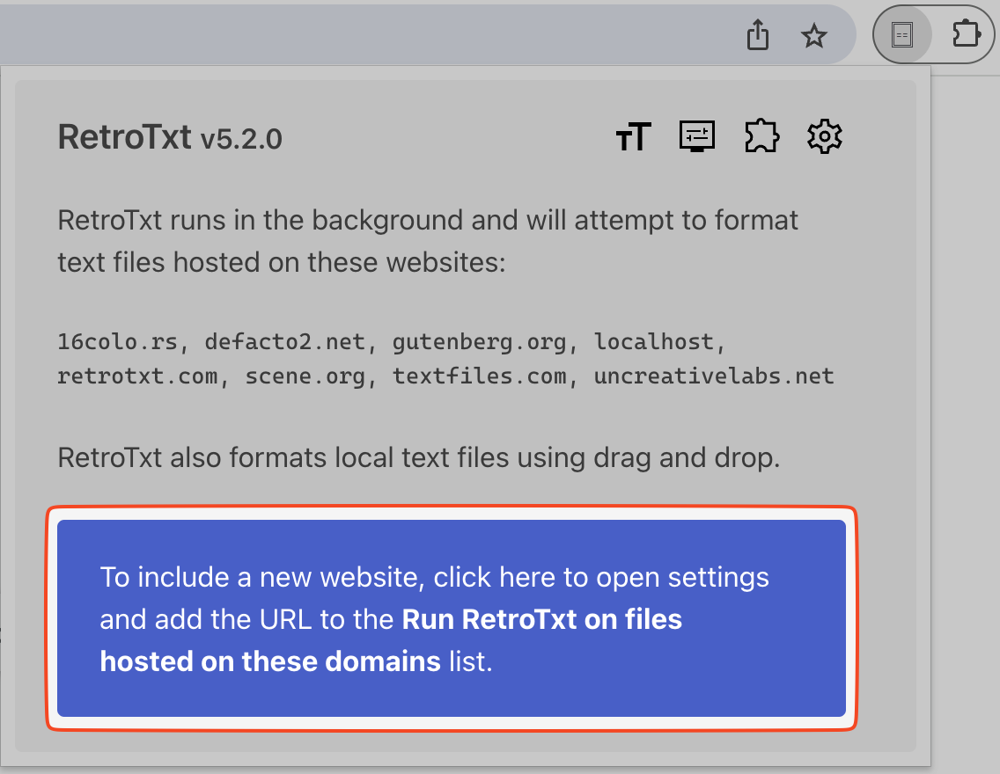
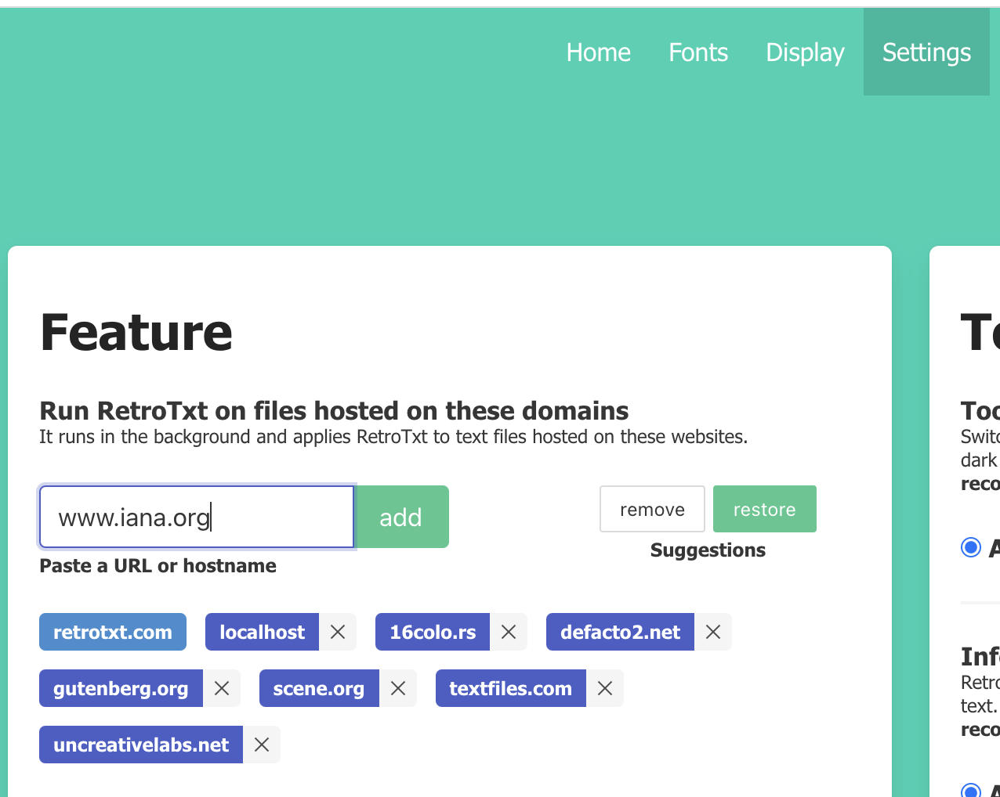
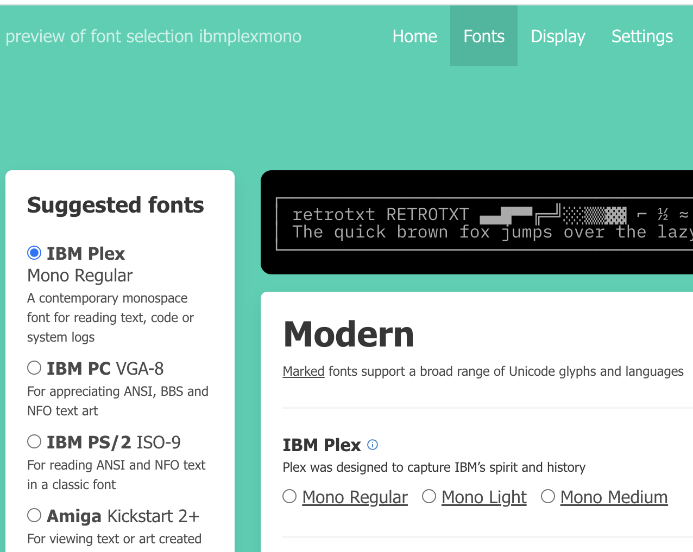
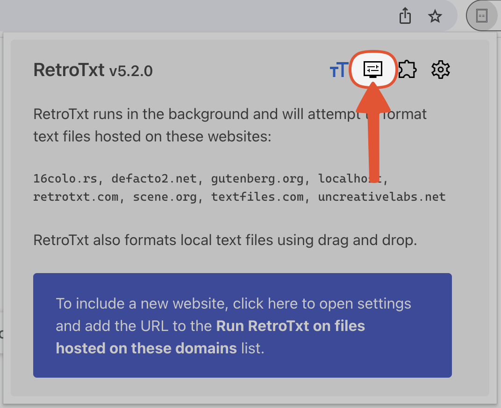
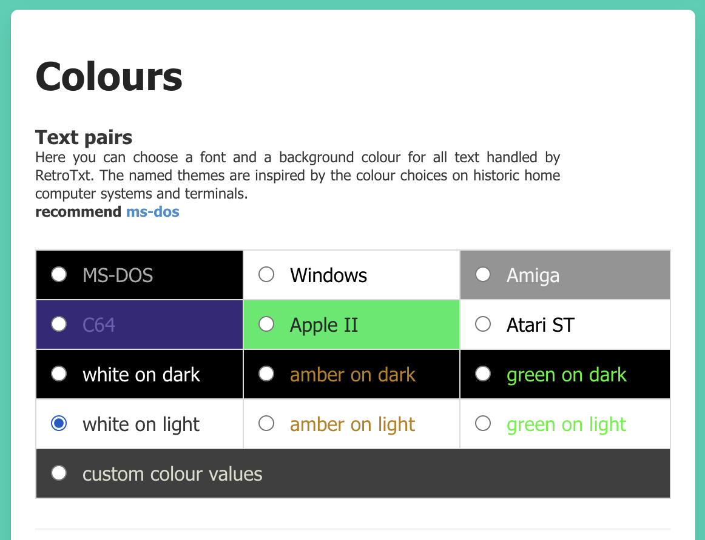
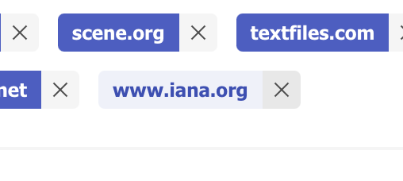

---
hide:
---
# First-time usage

!!! tip inline end "Read and change all data"
    Despite this access, __RetroTxt always ignores websites other than those you tell it to monitor in the background__. It also ignores all markup text, such as HTML or XML, for your privacy and overall browser performance.

    [If unrestricted access remains a worry, you can configure the browser to restrict RetroTxt further](secure.md).

## Add extension

When you install [Chrome web store](https://chrome.google.com/webstore/detail/retrotxt/gkjkgilckngllkopkogcaiojfajanahn) or [Microsoft Edge add-ons](https://microsoftedge.microsoft.com/addons/detail/retrotxt/hmgfnpgcofcpkgkadekmjdicaaeopkog), your browser will prompt for permission to read and change all data on all websites. Unfortunately, there is no workaround to avoid this. For more information, see __Read and change all data__ to the right.

<figure markdown>
  { loading=lazy, width=600 }
  <figcaption>Extension prompt, Add "RetroTxt"?</figcaption>
</figure>

---

## New install

!!! question inline end "What is .ANS"
    The `.ANS` filename extension signifies text files embedded with ANSI escape control characters for terminals to permit the layout and colorization of the text.

Once installed, you can test the functionality by viewing the RetroTxt ANSI logo hosted at:

**[retrotxt.com/e/preview_02.ans](https://retrotxt.com/e/preview_02.ans)**

<figure markdown>
  { loading=lazy, width=600 }
  <figcaption>RetroTxt ANSI logo in the tab</figcaption>
</figure>

---

## Hide the header

You can click the blue arrow on the upper-left corner to hide the header and remove the clutter.

<figure markdown>
  { loading=lazy, width=600 }
  <figcaption>The blue arrow is clickable and hides the header</figcaption>
</figure>

<figure markdown>
  { loading=lazy, width=600 }
  <figcaption>The clutter free display</figcaption>
</figure>

---

## Original text

If you want to view the original ANSI document, focus the tab and to launch a view source tab, tap:

++ctrl++ <kbd>u</kbd> &nbsp; or &nbsp; ++command++ ++option++ <kbd>u</kbd>

<figure markdown>
  { loading=lazy, width=600 }
  <figcaption>RetroTxt logo raw ANSI text</figcaption>
</figure>

---

## Monitor a new website

This example shows how to add a new website to the collection that RetroTxt monitors in the background. In this case, we will use the Internet Assigned Numbers Authority website at [iana.org](https://www.iana.org), which hosts many documents in plain text.

- In a tab, open the text document [special-use-domain-names.txt](https://www.iana.org/assignments/special-use-domain-names/special-use-domain-names.txt).

- Despite being plain text, RetroTxt ignores the page as it is not monitoring [iana.org](https://www.iana.org).

<figure markdown>
  { loading=lazy, width=600 }
  <figcaption>Special-Use Domain Names text document</figcaption>
</figure>

- Click the RetroTxt toolbar button and a popup will display the websites it monitors in the background. [You can learn more about or remove these websites](secure.md/#remove-suggestions).

<figure markdown>
  { loading=lazy, width=600 }
  <figcaption>The popup button (blue) is often hidden behind the Extensions button (red)</figcaption>
</figure>

- In the popup, click the blue _To include a new website_ button.

<figure markdown>
  { loading=lazy, width=600 }
  <figcaption>Toolbar popup</figcaption>
</figure>

- Under __Feature__ `>` _Autorun for websites_ `>` _Paste a URL or hostname_ input, copy and __add__ the website URL: 
[https://www.iana.org](https://www.iana.org)

<figure markdown>
  { loading=lazy, width=600 }
  <figcaption>Add and monitor www.iana.org</figcaption>
</figure>

!!! info inline end "Reload a tab"
    To reload or refresh a tab, tap <kbd>F5</kbd> &nbsp; or &nbsp; ++command++ <kbd>r</kbd>

- Switch back to the tab with the `special-use-domain-names.txt` document and reload. RetroTxt will now format the text!

<figure markdown>
  { loading=lazy, width=600 }
  <figcaption>Special-Use Domain Names styled with the IBM VGA font</figcaption>
</figure>

---

## Change the font

- Click the __RetroTxt fonts options__ button (the **TT** icon) in RetroTxt toolbar popup.

<figure markdown>
  { loading=lazy, width=600 }
  <figcaption>The RetroTxt fonts options button</figcaption>
</figure>

- Choose __IBM Plex__ Mono Regular from the __Suggested fonts__.

<figure markdown>
  { loading=lazy, width=600 }
  <figcaption>IBM Plex suggested fonts</figcaption>
</figure>

- Switch back to the tab with the `special-use-domain-names.txt` text, and the font will update.

<figure markdown>
  { loading=lazy, width=600 }
  <figcaption>Special-Use Domain Names using the IBM Plex mono font</figcaption>
</figure>

---

## Swap colors

- Click the __RetroTxt display options__ button (the monitor icon) in RetroTxt toolbar popup.

<figure markdown>
  { loading=lazy, width=600 }
  <figcaption>The RetroTxt display options button</figcaption>
</figure>

- Under __Text color__ `>` __Foreground and background pair__, choose the _white on light_ selection.

<figure markdown>
  { loading=lazy, width=600 }
  <figcaption>White on light text pair selection</figcaption>
</figure>

!!! tip inline end "ANSI text"
    A black background works best with ANSI text.

Switch to the tab with the `special-use-domain-names.txt` text, and the page colors will reflect the change. Feel free to revert to the _MS-DOS_ color pair or choose another.

<figure markdown>
  { loading=lazy, width=600 }
  <figcaption>The document using the white on light text pair selection</figcaption>
</figure>

---

## Remove a website monitor

Finally, to remove the monitoring of [www.iana.org](https://www.iana.org).

- Click the __RetroTxt settings__ button (the cog icon) in RetroTxt toolbar popup.

<figure markdown>
  { loading=lazy, width=600 }
</figure>

- Under __Feature__ `>` _Autorun for websites_

- Click the __X__ button (remove) besides the [www.iana.org](https://www.iana.org) entry.

<figure markdown>
  { loading=lazy, width=600 }
  <figcaption>Remove a URL or hostname</figcaption>
</figure>

- Switch back to the `special-use-domain-names.txt` document tab and reload. It should revert to the original, unformatted text.

<figure markdown>
  { loading=lazy, width=600 }
  <figcaption>The plain text document is in a browser tab</figcaption>
</figure>
