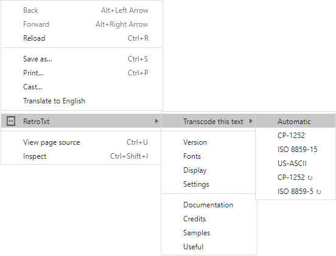

# Context menus

The context menu can be found by right-clicking on the active tab (web page) content and in Chrome by right-clicking the RetroTxt toolbar button.

## Transcode this text

{ align=right }

Character encoding is complicated, and the execution is not always precise. If you encounter a page not displaying as expected, you can transcode the text to show a different set of characters. Transcode text selections only apply to the active browser tab.

<figure markdown>

  <figcaption>Here is a text document with the correct character encoding</figcaption>
</figure>

<figure markdown>

  <figcaption>Here is the same document with the incorrect transcoding</figcaption>
</figure>

### Automatic

The default behavior lets RetroTxt try to determine the base character encoding of the text and, when needed, apply any transcoding.

**UTF-8** is the most common, contemporary code set to encoded Unicode text (including Emojis), and it is nearly always in use with HTML5. **ISO-8859-1** was the original code set used by Linux, the Commodore Amiga, and online during the 1990s. It is near identical to _ISO-8859-15_ but lacks a few European-centric characters, such as the `€` sign.

### CP-1252

Force the active tab to parse the source text using [**CP-1252**](https://en.wikipedia.org/wiki/Windows-1252) encoding.

### ISO 8859-15

Force the active tab to display the text using [**ISO-8859-15**](https://en.wikipedia.org/wiki/ISO/IEC_8859-15), the recommended encoding for Linux and the web in the 2000s.

### US-ASCII

Force the active tab not to transcode and can help to make documents encoded in
[**UTF-8**](https://en.wikipedia.org/wiki/UTF-8) or [**ISO-8859-1**](https://en.wikipedia.org/wiki/ISO/IEC_8859-1) to display.

### ⇉ CP-1252

Force the active tab to display the text using **CP-1252**, a familiar legacy Microsoft Windows encoding instead of the default MS-DOS [CP-437](https://en.wikipedia.org/wiki/Code_page_437).

### ⇉ ISO 8859-5

Force the active tab to parse the source text using [**ISO 8895-5**](https://en.wikipedia.org/wiki/ISO/IEC_8859-5) encoding.
