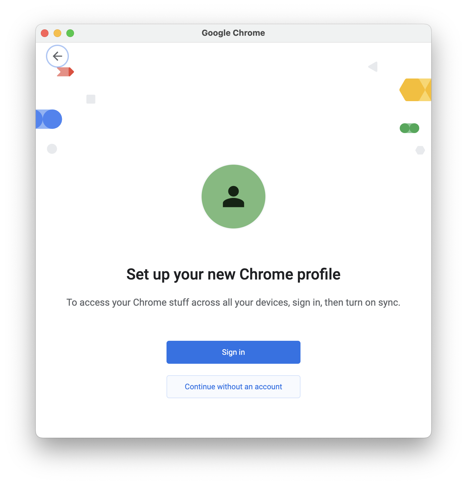
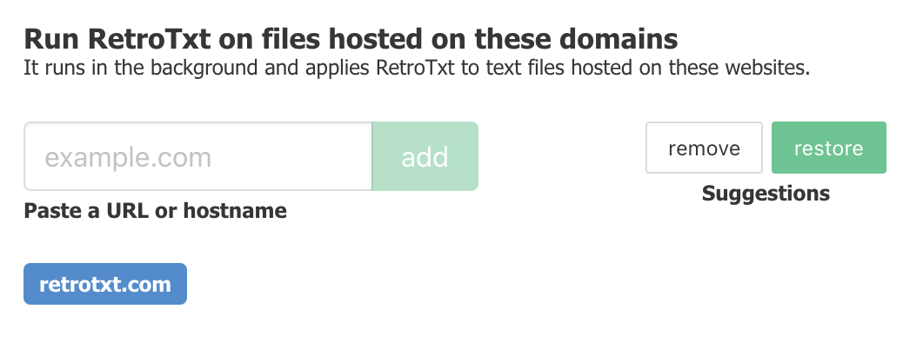
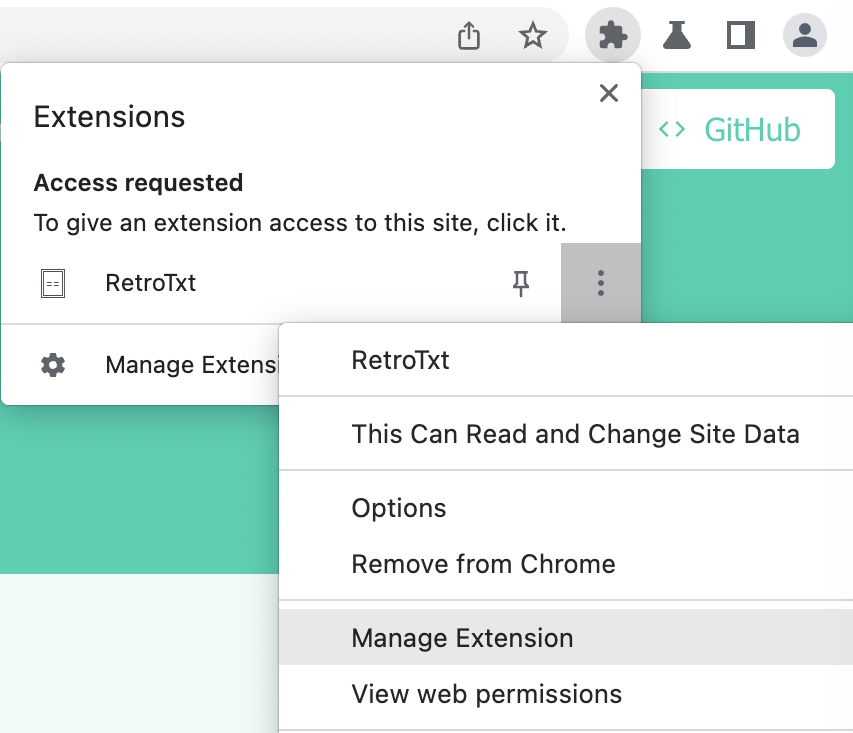
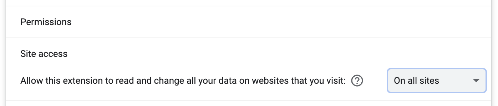
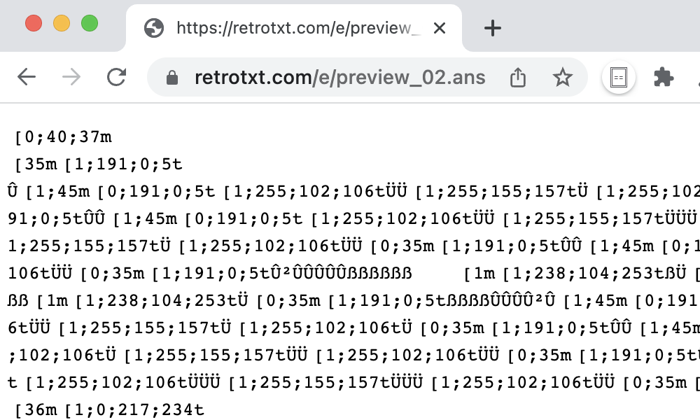

# Secure and restrict RetroTxt

!!! info inline end ""
    For security and performance, **RetroTxt will only work on websites and domains you specifically list** in the _Autorun for websites_ list. [From there you can add or remove the domains of your choosing](first.md#monitor-a-new-website).

Unfortunately, on installation, RetroTxt requests the permission to __Read and change all your data on all websites__. It is a limitation of the permission configuration, and in the future, I hope these can be fine-tuned and narrowed.

RetroTxt ignores all websites other than those you tell it to monitor in the background and [does not collect or transmit any data](../privacy.md). But if you work in a corporate environment or want to limit access, please read on.

<figure markdown>
  { loading=lazy, width=600 }
  <figcaption>Add extension, broad permission request</figcaption>
</figure>

---

## Add RetroTxt to its own isolated Profile

Firstly, I'd recommend [creating a new Chrome or Edge profile](https://support.google.com/chrome/answer/2364824) to install RetroTxt. The new profile does not need a Google or Microsoft account when using the __Continue without an account__ option. And importantly RetroTxt will only ever operate within that profile. By switching between profiles, any signed-in accounts and webpages will be isolated from RetroTxt.

<figure markdown>
  { loading=lazy, width=600 }
  <figcaption>Setup a new Chrome profile to isolate RetroTxt</figcaption>
</figure>

---

## Remove Suggestions

For the fans of ANSI and ASCII art, there are several websites that RetroTxt monitors in the background. Click the __RetroTxt settings__ button (the cog icon) in RetroTxt toolbar popup.

<figure markdown>
  { loading=lazy, width=600 }
  <figcaption>The popup button (blue) is often hidden behind the Extensions button (red)</figcaption>
</figure>

<figure markdown>
  { loading=lazy, width=600 }
  <figcaption>RetroTxt settings button in the toolbar popup</figcaption>
</figure>

Under __Feature__ `>` __Autorun for websites__, click the **remove** button above _Suggestions_, and now RetroTxt will only monitor [retrotxt.com](https://retrotxt.com). Read on to also block this.

<figure markdown>
  { loading=lazy }
  <figcaption>The remove button clears all the included websites</figcaption>
</figure>

---

## Manage extension

RetroTxt can be further isolated using the Manage extension configuration.

To access this, right-click the RetroTxt toolbar button and select _Manage extension_.

=== "Default"

    <figure markdown>
      { loading=lazy, width=400 }
      <figcaption>The RetroTxt toolbar button is hidden behind the __Extensions__ button</figcaption>
    </figure>

=== "Pinned"

    <figure markdown>
      { loading=lazy, width=400 }
      <figcaption>The RetroTxt button pinned to the toolbar</figcaption>
    </figure>

Scroll down to _Site access_ under _Permissions_.

Under the _Allow this extension to read and change all your data on websites you visit_, swap the ___On all sites___ to __On click__.

!!! warning ""
    **This setting blocks RetroTxt from being notified of or accessing any tabs.**

<figure markdown>
  { loading=lazy, width=600 }
  <figcaption>Permissions, on click site access</figcaption>
</figure>

!!! tip inline end "Refresh tabs"
    After permitting access, any open tabs will need reloading.

To test the change, visit [https://retrotxt.com/e/preview_02.ans](https://retrotxt.com/e/preview_02.ans) and the tab displays an unchanged ANSI document in raw text, as RetroTxt cannot access this and any other tabs.

But the __RetroTxt toolbar button is subtly highlighted and embossed to signify it is blocked__. Clicking it permits RetroTxt to access [retrotxt.com](https://retrotxt.com) temporarily for the browser session.

<figure markdown>
  { loading=lazy, width=600 }
  <figcaption>The outline and emboss RetroTxt toolbar button.</figcaption>
</figure>